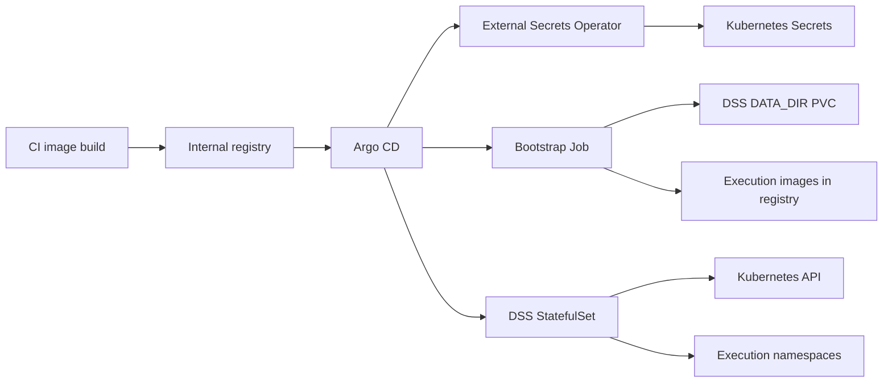

# Dataiku Kubernetes Architecture

## Components

- Argo CD controls deployment and drift remediation.
- External Secrets Operator syncs Vault secrets into Kubernetes Secrets.
- The Dataiku runtime image is built internally from the official DSS kit.
- Dataiku Design runs as a StatefulSet with a single replica and a dedicated
  block-storage PVC for `DATA_DIR`.
- Docker-in-Docker is used by default to satisfy Dataiku image build commands.
- Bootstrap initializes `DATA_DIR` and builds the Dataiku execution images.

## Flow

## Storage

`DATA_DIR` must be backed by POSIX block storage. Do not use NFS, GlusterFS,
EFS, or any shared filesystem that does not support the lock and filesystem
semantics required by DSS.

## Image Lifecycle

1. CI builds `dss-runtime`.
2. A GitOps PR updates the image tag.
3. Argo CD runs bootstrap.
4. Bootstrap builds and pushes execution images.
5. Runtime starts DSS.

After each DSS upgrade, execution images and code env images must be rebuilt.

